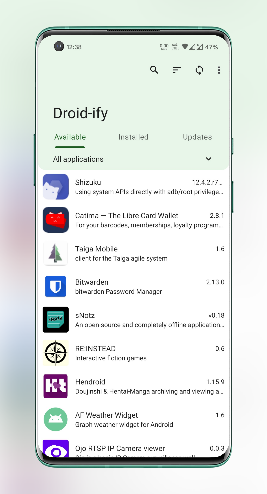
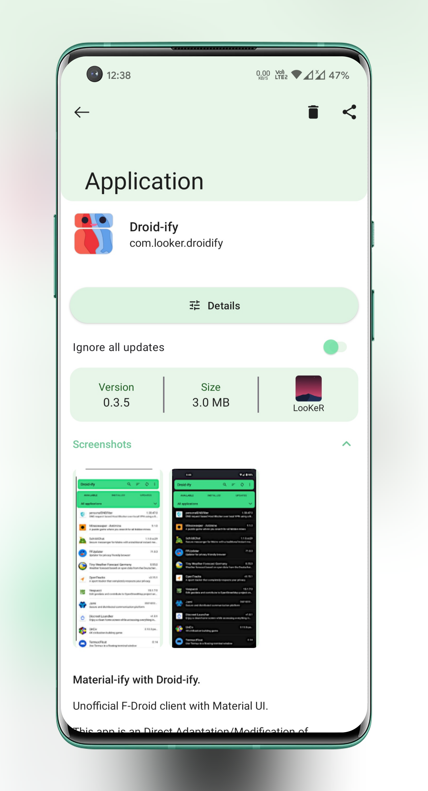
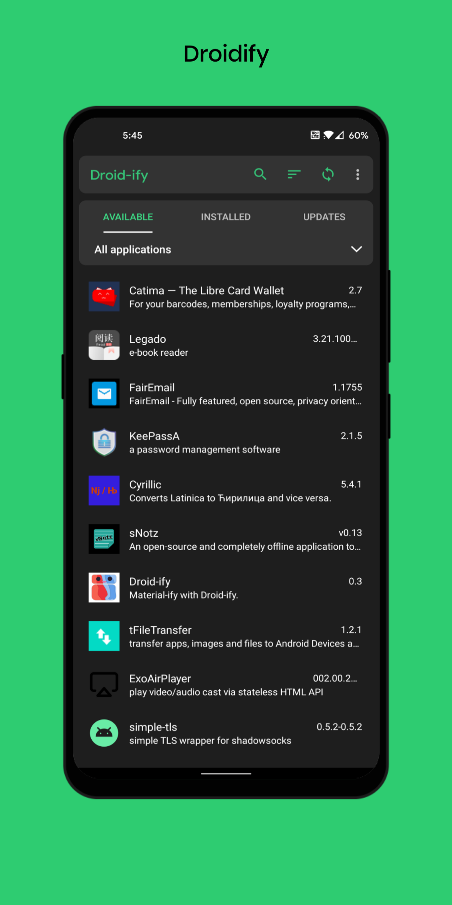
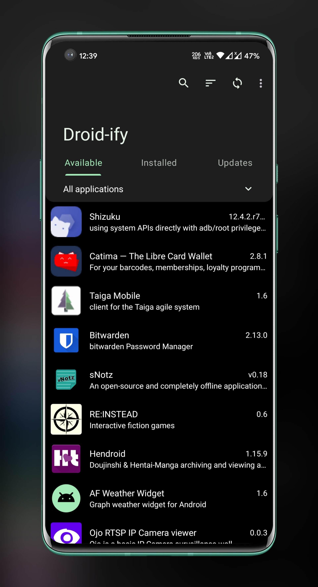
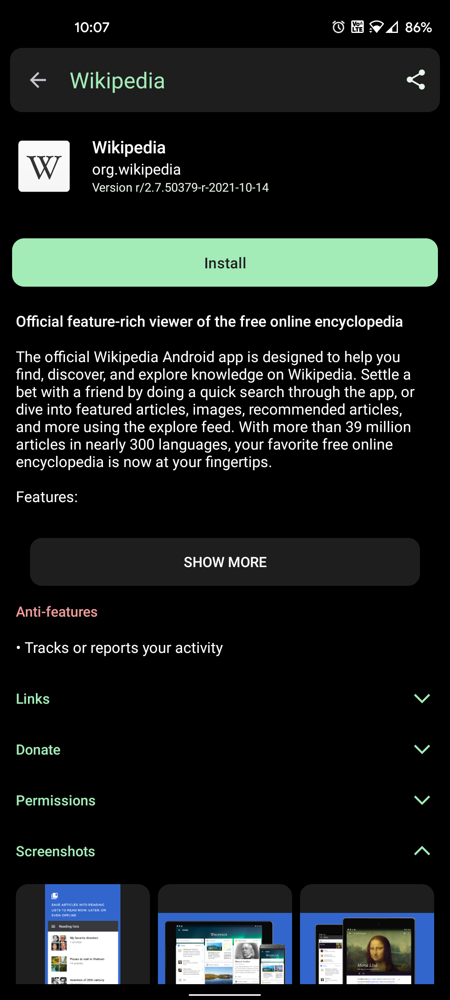

# Droid-ify

### A quick material F-Droid client.

&nbsp;&nbsp;

## :book: Features

* Material F-Droid style
* No cards or inappropriate animations
* Fast repository syncing
* Standard Android components and minimal dependencies

### :camera: Screenshots

## :hammer: Building and Installing

You need [Android Studio](https://developer.android.com/studio) to build this App.\
After Installing Android Studio, select `Project from Version Control` and paste the link of this repository.\
Navigate to `Build > APK > Create New Keystore > Enter the password` and wait for the build to finish.

## Contribution

### `dev` branch will be live soon till then please continue submitting PR's to `main` branch\

You can fork the [`dev`](https://github.com/Iamlooker/Droid-ify/tree/dev) branch and Open a Pull Request in the same branch.\
Your PR will be reviewed and merged.\
Your contributions are very important for this community.

## 👁️‍🗨️ Translations
[Translate Droid-ify on Hosted Weblate](https://hosted.weblate.org/engage/droidify/). \

You can always add other lanuages.
  

## :scroll: License

Licensed GPLv3+. \
Direct Adaptation/Modification of [Foxy-Droid](https://github.com/kitsunyan/foxy-droid/) \
Copyright © 2022 Iamlooker and contributors.
