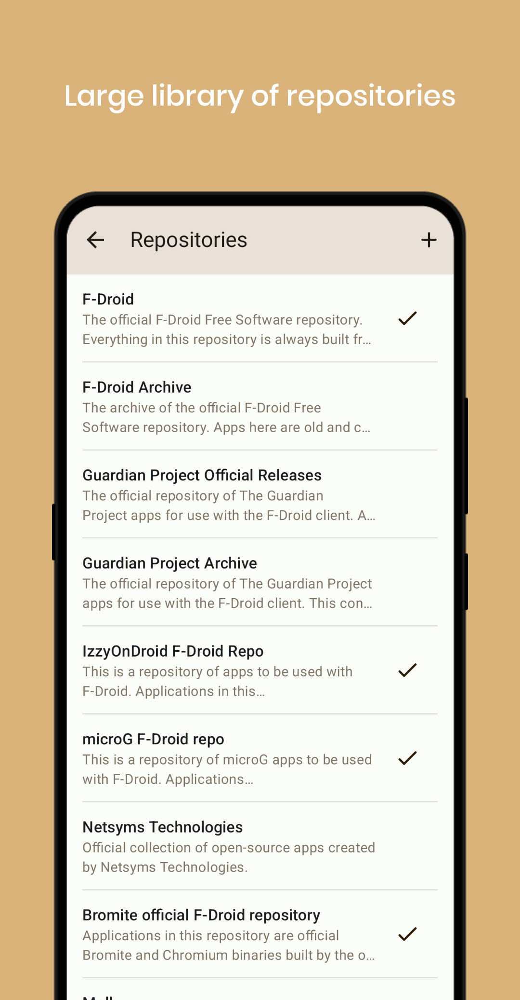
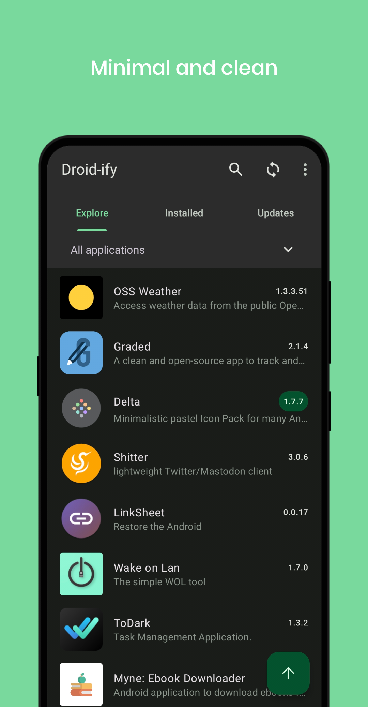
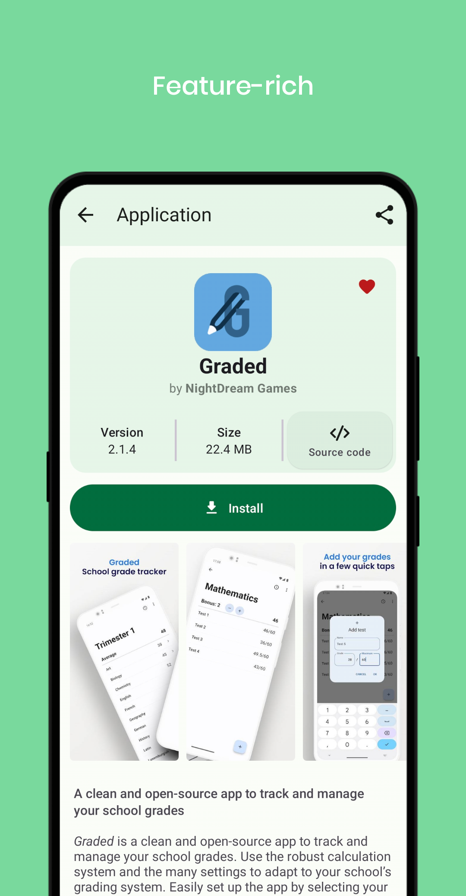
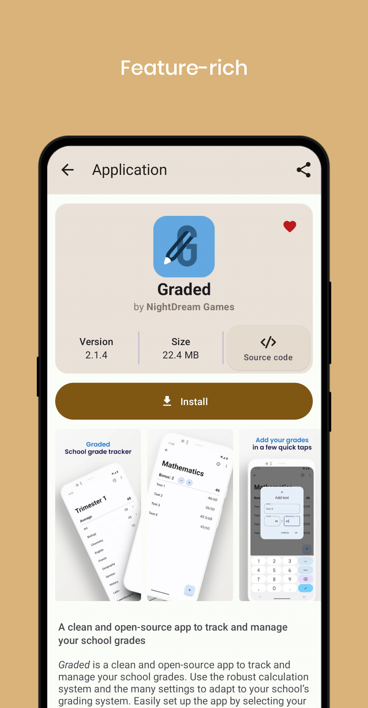

<div align="center">


[](https://github.com/Iamlooker/Droid-ify/stargazers)
[](https://github.com/Iamlooker/Droid-ify/blob/master/COPYING)
[](https://github.com/Iamlooker/Droid-ify/releases/)
[](https://github.com/Iamlooker/Droid-ify/releases/latest)
[](https://f-droid.org/packages/com.looker.droidify)

<div align="left">

## Features

* Material & Clean design
* Fast repository syncing
* Smooth user experience
* Feature-rich

## Screenshots



## Building and Installing
1. **Install Android Studio**:
    - Download and install [Android Studio](https://developer.android.com/studio) on your computer if you haven't already.

2. **Clone the Repository**:
    - Open Android Studio and select "Project from Version Control."
    - Paste the link to this repository to clone it to your local machine.

3. **Build the APK**:
    - In Android Studio, navigate to `Build > APK`.
    - Select "Create New Keystore" and enter the required information, including a password.
    - Wait for the build process to finish.

## TODO

- [ ] Add support for `index-v2`
- [ ] Add detekt code-analysis
- [ ] Add GitHub Repo feature

## Contribution

- Pick any issue you would like to resolve
- Fork the project
- Open a Pull Request
- Your PR will undergo review

## Translations
[](https://hosted.weblate.org/engage/droidify/?utm_source=widget)

## License

```
Droid-ify

Copyright (C) 2023 LooKeR
This program is free software: you can redistribute it and/or modify
it under the terms of the GNU General Public License as published by
the Free Software Foundation, either version 3 of the License, or
(at your option) any later version.
This program is distributed in the hope that it will be useful,
but WITHOUT ANY WARRANTY; without even the implied warranty of
MERCHANTABILITY or FITNESS FOR A PARTICULAR PURPOSE.  See the
GNU General Public License for more details.
You should have received a copy of the GNU General Public License
along with this program.  If not, see <http://www.gnu.org/licenses/>.
```
