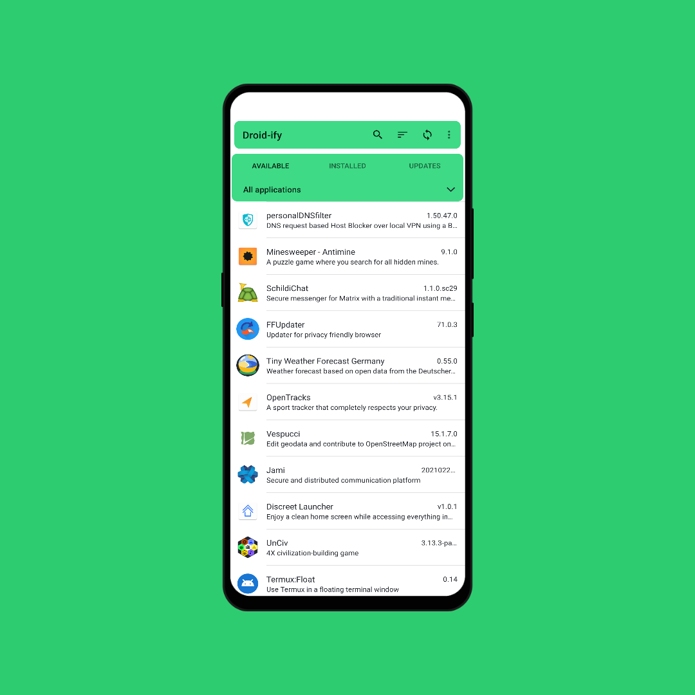
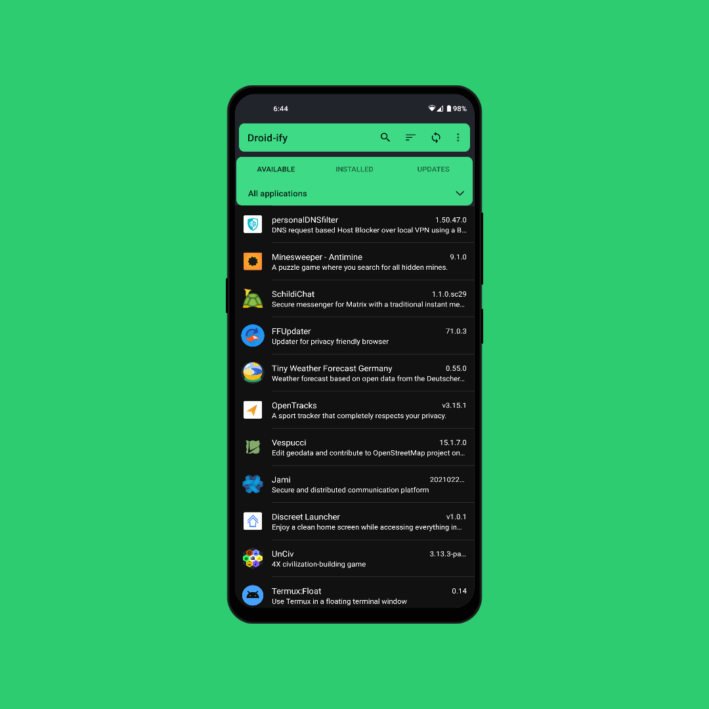

# Foxy Droid

Material-ify with Droid-ify.

## Description

Unofficial F-Droid client with Material UI.

This app is an Direct Adaptation/Modification of [Foxy-Droid](https://github.com/kitsunyan/foxy-droid/)

### Features

* Material F-Droid style
* No cards or inappropriate animations
* Fast repository syncing
* Standard Android components and minimal dependencies
    
### Screenshots

<p>


</p>

## Building and Installing

Specify your Android SDK path either using the `ANDROID_HOME` environment variable, or by filling out the `sdk.dir`
property in `local.properties`.

Signing can be done automatically using `keystore.properties` as follows:

```properties
store.file=/path/to/keystore
store.password=key-store-password
key.alias=key-alias
key.password=key-password
```

Run `./gradlew assembleRelease` to build the package, which can be installed using the Android package manager.

## License

Droid-ify is available under the terms of the GNU General Public License v3 or later. Copyright © 2020 Iamlooker.
