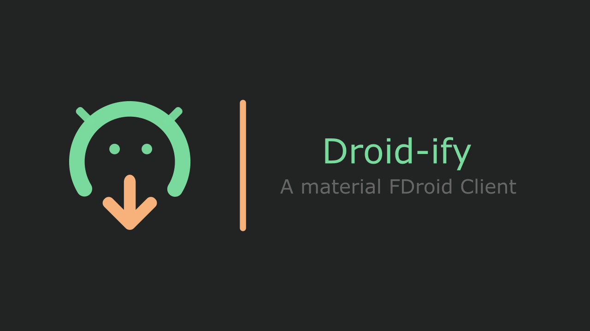
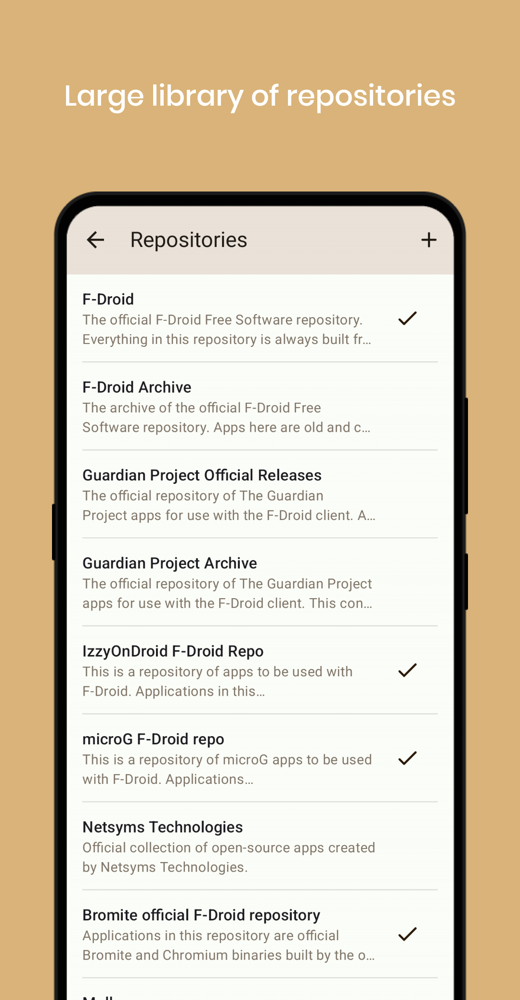
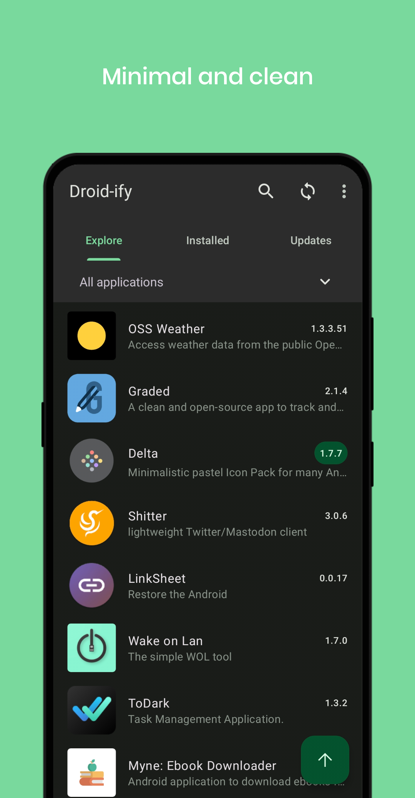
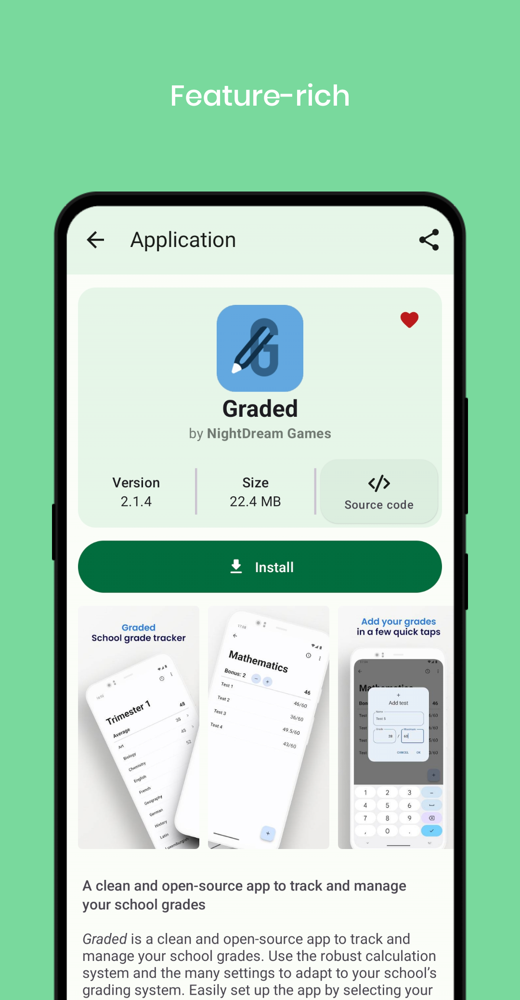
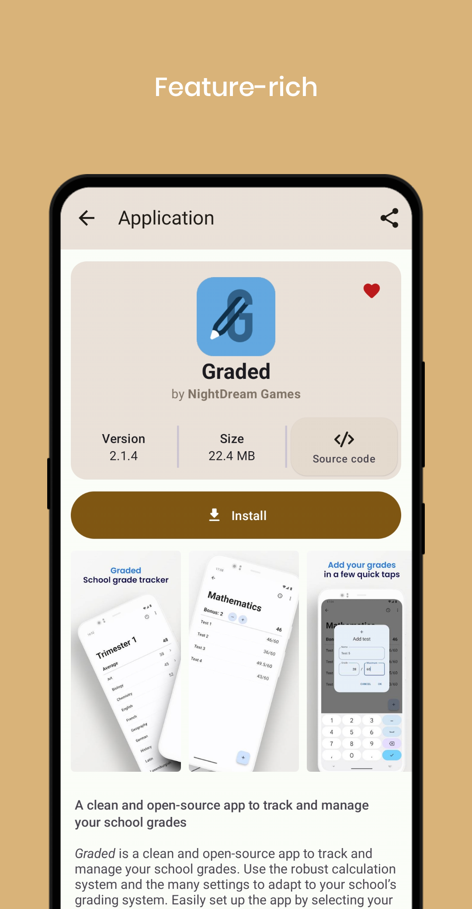

> [!Warning]
> **Free and Open-Source Android is under threat.**
>
> Google will turn Android into a locked-down platform, restricting your essential freedom to install apps of your choice. Make your voice heard
>
> [**Keep Android Open**](https://keepandroidopen.org/).

<div align="center">



**Clutterfree F-Droid client**

[](https://github.com/Iamlooker/Droid-ify/stargazers)
[](https://github.com/Iamlooker/Droid-ify/releases/)
[](https://github.com/Iamlooker/Droid-ify/releases/latest)
[](https://apt.izzysoft.de/fdroid/index/apk/com.looker.droidify)
[](https://f-droid.org/packages/com.looker.droidify)



</div>

<div align="left">

* Browse and install apps from F-Droid repositories
* Automatic app updates in the background
* Multiple installation methods (Session, Root, Shizuku)
* Add custom repositories with one tap
* Browse offline after initial sync

### Installation

[](https://apt.izzysoft.de/packages/com.looker.droidify)
[](https://f-droid.org/packages/com.looker.droidify/)

[GitHub](https://github.com/Iamlooker/Droid-ify/releases/latest)

**Signature:**
```
ED:88:59:C5:5A:F3:11:16:26:58:B9:4A:F9:82:B9:F0:91:DC:D2:76:28:D4:DE:34:86:D1:21:7E:BF:3C:99:35
```

> [!Note]
> Signature for versions from F-Droid might be different

#### Manual Building

```sh
git clone https://github.com/Droid-ify/client droidify
cd droidify
./gradlew assembleRelease
```

### Contribute

Code contribution: [CONTRIBUTING.md](CONTRIBUTING.md)
Translation: [Weblate](https://hosted.weblate.org/engage/droidify)

### License

```
Droid-ify

Copyright (C) 2026 LooKeR
This program is free software: you can redistribute it and/or modify
it under the terms of the GNU General Public License as published by
the Free Software Foundation, either version 3 of the License, or
(at your option) any later version.
This program is distributed in the hope that it will be useful,
but WITHOUT ANY WARRANTY; without even the implied warranty of
MERCHANTABILITY or FITNESS FOR A PARTICULAR PURPOSE.  See the
GNU General Public License for more details.
You should have received a copy of the GNU General Public License
along with this program.  If not, see <http://www.gnu.org/licenses/>.
```

</div>
