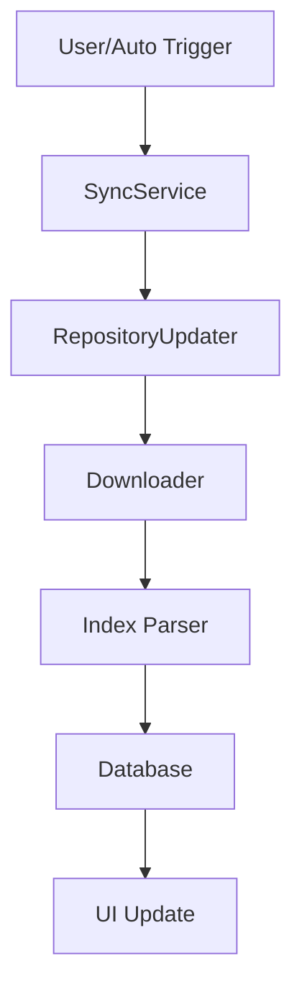
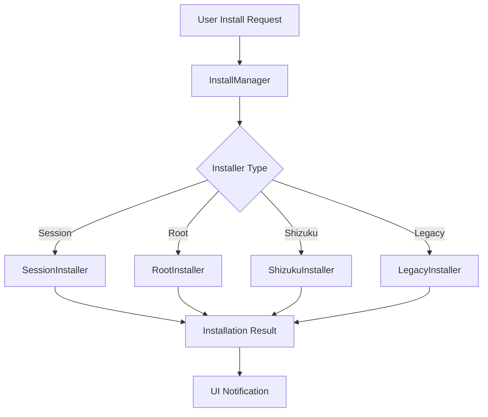

# 🏗️ Technical Architecture

This document provides an in-depth overview of Droid-ify's technical architecture, design patterns, and implementation details.

## 📋 Overview

Droid-ify is built using modern Android development practices with a focus on maintainability, testability, and performance. The app follows Clean Architecture principles with clear separation of concerns.

## 🎯 Architecture Principles

### Clean Architecture
- **Separation of Concerns**: Each layer has a single responsibility
- **Dependency Inversion**: Higher-level modules don't depend on lower-level modules
- **Independence**: Business logic is independent of UI and external frameworks

### Design Patterns
- **Repository Pattern**: Abstracts data sources
- **Observer Pattern**: Reactive programming with Flow/LiveData
- **Dependency Injection**: Hilt for managing dependencies
- **MVVM**: Model-View-ViewModel for UI layer

## 🏛️ Project Structure

```
app/src/main/kotlin/com/looker/droidify/
├── 📁 data/                    # Data Layer
│   ├── local/                  # Local data sources (Room)
│   └── encryption/             # Data encryption utilities
├── 📁 database/                # Legacy database components
│   ├── table/                  # Database table definitions
│   └── ...                     # Database helpers and adapters
├── 📁 datastore/               # DataStore preferences
│   ├── extension/              # DataStore extensions
│   ├── migration/              # Settings migration
│   └── model/                  # Settings data models
├── 📁 di/                      # Dependency Injection
│   ├── CoroutinesModule.kt     # Coroutine scope providers
│   ├── DatabaseModule.kt       # Database dependencies
│   └── DatastoreModule.kt      # DataStore dependencies
├── 📁 domain/                  # Domain Layer
│   ├── model/                  # Domain models
│   ├── AppRepository.kt        # App data repository interface
│   └── RepoRepository.kt       # Repository data interface
├── 📁 installer/               # Installation Management
│   ├── installers/             # Different installer implementations
│   ├── model/                  # Installation models
│   └── notification/           # Installation notifications
├── 📁 network/                 # Network Layer
│   ├── header/                 # HTTP headers
│   ├── validation/             # Response validation
│   └── ...                     # Network utilities
├── 📁 service/                 # Background Services
│   ├── SyncService.kt          # Repository synchronization
│   └── DownloadService.kt      # File downloads
├── 📁 sync/                    # Synchronization Logic
│   ├── v1/                     # Index V1 format support
│   ├── v2/                     # Index V2 format support
│   └── common/                 # Shared sync utilities
├── 📁 ui/                      # Presentation Layer
│   ├── appDetail/              # App details screen
│   ├── appList/                # App listing screens
│   ├── repository/             # Repository management
│   ├── settings/               # Settings screens
│   └── ...                     # Other UI components
└── 📁 utility/                 # Utilities & Extensions
    ├── common/                 # Common utilities
    └── extension/              # Kotlin extensions
```

## 🔄 Data Flow

### 1. Repository Synchronization Flow


### 2. App Installation Flow


## 🏗️ Core Components

### Database Layer

#### Room Database (New)
Located in `data/local/`, provides modern database abstraction:

```kotlin
@Database(
    entities = [
        AppEntity::class,
        RepoEntity::class,
        // ... other entities
    ],
    version = 2
)
abstract class DroidifyDatabase : RoomDatabase()
```

**Key DAOs:**
- `AppDao`: App metadata and package information
- `RepoDao`: Repository configuration and state
- `AuthDao`: Authentication credentials
- `IndexDao`: Repository index processing

#### Legacy Database
Located in `database/`, provides backward compatibility:
- `Database.kt`: Main database interface
- Table adapters for ProductAdapter, RepositoryAdapter, etc.

### Network Layer

#### Downloader (Ktor-based)
Primary network component for HTTP operations:

```kotlin
class KtorDownloader @Inject constructor(
    private val client: HttpClient
) : Downloader {
    suspend fun downloadIndex(...)
    suspend fun downloadFile(...)
}
```

**Features:**
- Progress tracking for downloads
- Resume support for interrupted downloads
- Proxy support (HTTP/SOCKS)
- Header validation and caching

#### Validation
- `IndexJarValidator`: Validates downloaded repository indices
- `SignatureValidator`: Verifies APK signatures

### Installation System

#### InstallManager
Central coordinator for all installation methods:

```kotlin
class InstallManager @Inject constructor(
    private val context: Context,
    private val settingsRepository: SettingsRepository
) {
    suspend fun install(installItem: InstallItem)
    suspend fun uninstall(packageName: PackageName)
}
```

#### Installer Implementations

1. **SessionInstaller** (Recommended)
   - Uses Android's PackageInstaller API
   - Modern installation method for Android 5.0+
   - Handles installation sessions and callbacks

2. **RootInstaller**
   - Silent installations with root access
   - Uses Shell commands for installation
   - Bypasses user interaction requirements

3. **ShizukuInstaller**
   - ADB-powered installations without root
   - Leverages Shizuku service for elevated permissions
   - Alternative to root for power users

4. **LegacyInstaller**
   - Traditional installation via Intent
   - Fallback for older Android versions
   - Requires user interaction for each install

### Synchronization System

#### Repository Formats

**Index V1 (Current)**
- Legacy F-Droid repository format
- JAR-based distribution with JSON index
- Implemented in `sync/v1/`

**Index V2 (Planned)**
- Modern F-Droid repository format
- Improved performance and features
- Partial implementation in `sync/v2/`

#### SyncService
Background service managing repository updates:

```kotlin
class SyncService : Service() {
    // Handles background synchronization
    // Manages sync scheduling and execution
    // Provides progress notifications
}
```

**Features:**
- Auto-sync with configurable intervals
- Network-aware synchronization (WiFi-only, etc.)
- Progress tracking and user notifications
- Conflict resolution and error handling

### Settings & Preferences

#### DataStore Integration
Modern preference management with type safety:

```kotlin
@Singleton
class PreferenceSettingsRepository @Inject constructor(
    private val dataStore: DataStore<Preferences>
) : SettingsRepository {
    // Type-safe preference access
    // Reactive preference changes
    // Migration from SharedPreferences
}
```

**Key Settings:**
- Theme and appearance
- Sync configuration
- Installer preferences
- Network and proxy settings
- Language and localization

## 🔧 Dependency Injection

### Hilt Modules

#### DatabaseModule
Provides database-related dependencies:
```kotlin
@Module
@InstallIn(SingletonComponent::class)
object DatabaseModule {
    @Provides @Singleton
    fun provideDatabase(context: Context): DroidifyDatabase
    
    @Provides @Singleton  
    fun provideAppDao(db: DroidifyDatabase): AppDao
}
```

#### NetworkModule
Configures network components:
```kotlin
@Module
@InstallIn(SingletonComponent::class)
object NetworkModule {
    @Provides @Singleton
    fun provideHttpClient(): HttpClient
    
    @Provides @Singleton
    fun provideDownloader(client: HttpClient): Downloader
}
```

## 🎨 UI Architecture

### Fragment-Based Navigation
Current UI uses traditional Fragment navigation:
- `MainActivity`: Single activity container
- Fragment-based screens with backstack management
- Material 3 theming and components

### Planned Migration
Future versions may migrate to:
- **Jetpack Compose**: Modern declarative UI
- **Navigation Component**: Type-safe navigation
- **ViewModel**: Improved state management

## 🔒 Security Considerations

### Signature Verification
All APK downloads undergo cryptographic verification:
- Repository fingerprint validation
- APK signature checking
- Anti-tampering measures

### Data Protection
- Sensitive data encryption at rest
- Secure credential storage
- Privacy-focused design (no tracking)

### Network Security
- Certificate pinning for critical endpoints
- Proxy support for enhanced privacy
- Network security configuration

## ⚡ Performance Optimizations

### Database Performance
- Efficient queries with proper indexing
- Background thread operations
- Connection pooling and caching

### Network Performance  
- HTTP/2 support with connection multiplexing
- Intelligent caching strategies
- Resume-capable downloads
- Parallel repository synchronization

### Memory Management
- Image loading optimization with Coil
- Proper lifecycle management
- Memory leak prevention

## 🧪 Testing Strategy

### Unit Tests
- Repository pattern testing
- Business logic validation
- Utility function testing

### Integration Tests
- Database migration testing
- Network operation testing
- Installer functionality testing

### UI Tests
- Fragment interaction testing
- User flow validation
- Accessibility testing

## 📊 Monitoring & Debugging

### Logging
Structured logging throughout the application:
```kotlin
private val log = LoggerFactory.getLogger(ClassName::class.java)
log.info("Operation completed successfully")
```

### Performance Monitoring
- Database query performance tracking
- Network request monitoring  
- Installation success/failure rates

## 🔄 Future Architecture Plans

### Planned Improvements
1. **Jetpack Compose Migration**: Modern UI framework
2. **Modularization**: Feature-based modules
3. **Index V2 Support**: Enhanced repository format
4. **Improved Testing**: Comprehensive test coverage
5. **Performance Analytics**: Better monitoring tools

### Technical Debt
- Legacy database migration completion
- Code duplication elimination
- Dependency updates and modernization
- Documentation improvements

---

*This document is a living guide that evolves with the codebase. For questions or clarifications, please refer to the code comments or open a discussion.* 