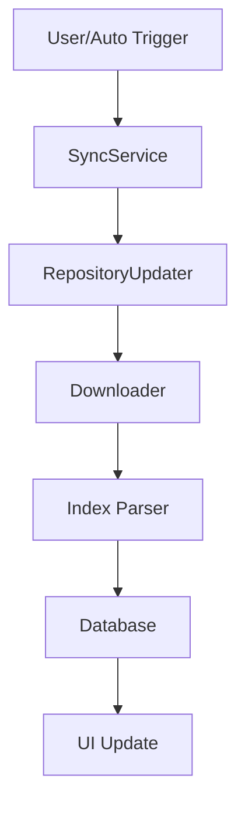
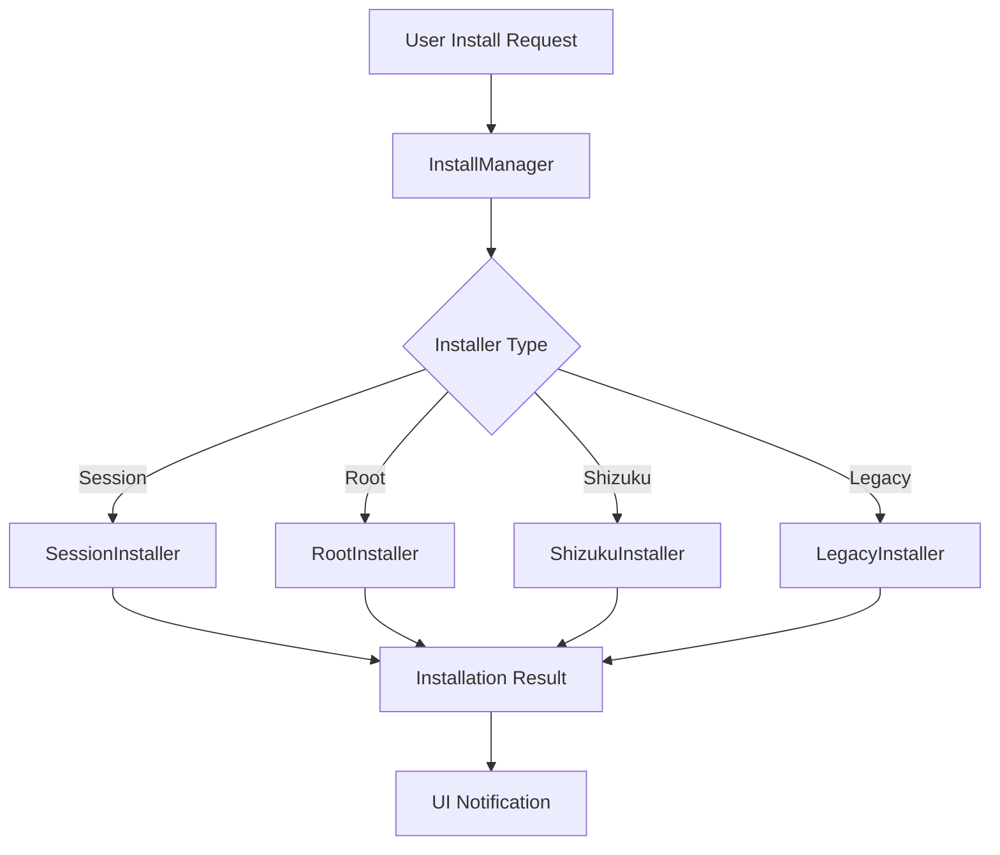

# 🏗️ Technical Architecture

This document provides an in-depth overview of Droid-ify's technical architecture, design patterns, and implementation details.

## 📋 Overview

Droid-ify is built using modern Android development practices with a focus on maintainability, testability, and performance. The app follows Clean Architecture principles with clear separation of concerns.

Droid-ify is transitioning to a new architecture. This document outlines the current and future architecture, as well as common components that will be shared between both.

## 🎯 Architecture Principles

### Clean Architecture
- **Separation of Concerns**: Each layer has a single responsibility
- **Dependency Inversion**: Higher-level modules don't depend on lower-level modules
- **Independence**: Business logic is independent of UI and external frameworks

### Design Patterns
- **Repository Pattern**: Abstracts data sources
- **Observer Pattern**: Reactive programming with Flow/LiveData
- **Dependency Injection**: Hilt for managing dependencies
- **MVVM**: Model-View-ViewModel for UI layer

## 🔄 Architecture Transition

### Future Architecture (Will Replace Current Implementation)

#### 1. `data/*`
- Contains both the data layer and domain layer of the application
- Uses Room for database operations
- Contains domain models and business logic
- Clean data classes without framework dependencies
- Uses Kotlin value classes for type safety (e.g., `Fingerprint`, `PackageName`, `Platforms`)
- Organized into:
  - `data/local/model` - Entity classes for database tables
  - `data/local/dao` - DAO interfaces for database operations
  - `data/local/converters` - Type converters for Room
  - `data/encryption` - Encryption utilities for secure data storage
  - `data/model` - Domain models like App, Package, Repo, etc.
  - Domain repositories directly in `data/` (e.g., `PrivacyRepository.kt`, `AppRepository.kt`)

#### 2. `sync/*`
- Handles data synchronization with remote repositories
- Supports multiple versions of the sync protocol (v1, v2)
- Organized into:
  - `sync/v1` - Models and parsers for version 1 of the sync protocol
  - `sync/v2` - Models and parsers for version 2 of the sync protocol
  - `sync/common` - Common utilities for both versions
  - `sync/utils` - Utility classes for sync operations

### Common Components (Shared Between Current and Future)

#### 1. `work/*`
- Uses Android's WorkManager for background tasks
- Contains workers for specific tasks:
  - `RBLogWorker` - Handles RBLog operations (privacy tracking)
  - `CleanUpWorker` - Cleans up resources
- Uses Hilt's `@AssistedInject` for dependency injection

#### 2. `network/*`
- Handles network operations
- Uses Ktor for HTTP requests
- Organized into:
  - `NetworkResponse.kt` - Sealed classes for representing network responses
  - `KtorDownloader.kt` - Downloader implementation using Ktor
  - `network/header` - Utilities for handling HTTP headers
  - `network/validation` - Validation utilities for network responses

#### 3. `installer/*`
- Handles app installation
- Implements multiple installation methods using the strategy pattern
- Organized into:
  - `installer/installers/session` - Uses Android's PackageInstaller session API
  - `installer/installers/root` - Uses root access for installation
  - `installer/installers/shizuku` - Uses Shizuku for installation
  - `installer/model` - Models for installation state and items

#### 4. `di/*`
- Handles dependency injection using Hilt
- Contains modules for different components:
  - `CoroutinesModule.kt` - Provides coroutine dispatchers and scopes
  - `DatabaseModule.kt` - Provides database-related dependencies
  - `DatastoreModule.kt` - Provides datastore-related dependencies
  - `InstallModule.kt` - Provides installer-related dependencies
  - `NetworkModule.kt` - Provides network-related dependencies
  - `SyncableModule.kt` - Provides sync-related dependencies

#### 5. `datastore/*`
- Uses Android's Jetpack DataStore for storing preferences and settings
- Organized into:
  - `datastore/model` - Models for settings (InstallerType, ProxyPreference, SortOrder, Theme, etc.)
  - `datastore/exporter` - Utilities for exporting settings
  - `datastore/migration` - Migration utilities for older storage mechanisms
  - `PreferenceSettingsRepository.kt` - Repository for accessing and modifying settings

### Legacy Architecture (Replaced)

#### 1. `model/*`
- Contains legacy domain models
- Being replaced by `data/model/*`

#### 2. `database/*` (Removed)
- Contained legacy database implementation using SQLite directly
- Has been replaced by `data/local/*` using Room

## 🏛️ Project Structure

```
app/src/main/kotlin/com/looker/droidify/
├── 📁 data/                    # Data & Domain Layer
│   ├── local/                  # Local data sources (Room)
│   │   ├── dao/                # Data Access Objects
│   │   ├── model/              # Entity classes
│   │   ├── converters/         # Type converters
│   │   └── repos/              # Repository implementations
│   ├── encryption/             # Data encryption utilities
│   ├── model/                  # Domain models
│   ├── AppRepository.kt        # App data repository interface
│   ├── InstalledRepository.kt  # Installed apps repository interface
│   ├── PrivacyRepository.kt    # Privacy data repository interface
│   └── RepoRepository.kt       # Repository data repository interface
├── 📁 datastore/               # DataStore preferences
│   ├── extension/              # DataStore extensions
│   ├── migration/              # Settings migration
│   └── model/                  # Settings data models
├── 📁 di/                      # Dependency Injection
│   ├── CoroutinesModule.kt     # Coroutine scope providers
│   ├── DatabaseModule.kt       # Database dependencies
│   └── DatastoreModule.kt      # DataStore dependencies
├── 📁 installer/               # Installation Management
│   ├── installers/             # Different installer implementations
│   ├── model/                  # Installation models
│   └── notification/           # Installation notifications
├── 📁 network/                 # Network Layer
│   ├── header/                 # HTTP headers
│   ├── validation/             # Response validation
│   └── ...                     # Network utilities
├── 📁 service/                 # Background Services
│   ├── SyncService.kt          # Repository synchronization
│   └── DownloadService.kt      # File downloads
├── 📁 sync/                    # Synchronization Logic
│   ├── v1/                     # Index V1 format support
│   ├── v2/                     # Index V2 format support
│   └── common/                 # Shared sync utilities
├── 📁 ui/                      # Presentation Layer
│   ├── appDetail/              # App details screen
│   ├── appList/                # App listing screens
│   ├── repository/             # Repository management
│   ├── settings/               # Settings screens
│   └── ...                     # Other UI components
└── 📁 utility/                 # Utilities & Extensions
    ├── common/                 # Common utilities
    └── extension/              # Kotlin extensions
```

## 🔄 Data Flow

### 1. Repository Synchronization Flow


### 2. App Installation Flow


## 🏗️ Core Components

### Database Layer

#### Room Database
Located in `data/local/`, provides type-safe database abstraction:

```kotlin
@Database(
    version = 1,
    exportSchema = true,
    entities = [
        AntiFeatureEntity::class,
        AntiFeatureAppRelation::class,
        AntiFeatureRepoRelation::class,
        AuthenticationEntity::class,
        AuthorEntity::class,
        AppEntity::class,
        CategoryEntity::class,
        CategoryAppRelation::class,
        CategoryRepoRelation::class,
        DonateEntity::class,
        GraphicEntity::class,
        InstalledEntity::class,
        LinksEntity::class,
        MirrorEntity::class,
        RepoEntity::class,
        ScreenshotEntity::class,
        VersionEntity::class,
        RBLogEntity::class,
    ],
)
@TypeConverters(
    PermissionConverter::class,
    Converters::class,
)
abstract class DroidifyDatabase : RoomDatabase()
```

**Key DAOs:**
- `AppDao`: App metadata and package information
- `RepoDao`: Repository configuration and state
- `AuthDao`: Authentication credentials
- `IndexDao`: Repository index processing
- `InstalledDao`: Installed applications information
- `RBLogDao`: Privacy tracking data

The database is initialized with proper configuration for performance:

```kotlin
fun droidifyDatabase(context: Context): DroidifyDatabase = Room
    .databaseBuilder(
        context = context,
        klass = DroidifyDatabase::class.java,
        name = "droidify_room",
    )
    .addCallback(
        object : RoomDatabase.Callback() {
            override fun onOpen(db: SupportSQLiteDatabase) {
                super.onOpen(db)
                db.query("PRAGMA synchronous = OFF")
                db.query("PRAGMA journal_mode = WAL")
            }
        },
    )
    .build()
```

### Network Layer

#### Downloader (Ktor-based)
Primary network component for HTTP operations:

```kotlin
interface Downloader {
    suspend fun headCall(
        url: String,
        headers: HeadersBuilder.() -> Unit = {}
    ): NetworkResponse

    suspend fun downloadToFile(
        url: String,
        target: File,
        validator: FileValidator? = null,
        headers: HeadersBuilder.() -> Unit = {},
        block: ProgressListener? = null
    ): NetworkResponse
}
```

**Features:**
- Progress tracking for downloads
- Resume support for interrupted downloads
- Proxy support (HTTP/SOCKS)
- Header validation and caching

#### Validation
- `IndexJarValidator`: Validates downloaded repository indices
- `SignatureValidator`: Verifies APK signatures

### Installation System

#### InstallManager
Central coordinator for all installation methods:

```kotlin
class InstallManager @Inject constructor(
    private val context: Context,
    private val settingsRepository: SettingsRepository
) {
    suspend fun install(installItem: InstallItem)
    suspend fun uninstall(packageName: PackageName)
}
```

#### Installer Implementations

1. **SessionInstaller** (Recommended)
   - Uses Android's PackageInstaller API
   - Modern installation method for Android 5.0+
   - Handles installation sessions and callbacks

2. **RootInstaller**
   - Silent installations with root access
   - Uses Shell commands for installation
   - Bypasses user interaction requirements

3. **ShizukuInstaller**
   - ADB-powered installations without root
   - Leverages Shizuku service for elevated permissions
   - Alternative to root for power users

4. **LegacyInstaller**
   - Traditional installation via Intent
   - Fallback for older Android versions
   - Requires user interaction for each install

### Synchronization System

#### Repository Formats

**Index V1 (Current)**
- Legacy F-Droid repository format
- JAR-based distribution with JSON index
- Implemented in `sync/v1/`

**Index V2 (Planned)**
- Modern F-Droid repository format
- Improved performance and features
- Partial implementation in `sync/v2/`

#### SyncService
Background service managing repository updates:

```kotlin
class SyncService : Service() {
    // Handles background synchronization
    // Manages sync scheduling and execution
    // Provides progress notifications
}
```

**Features:**
- Auto-sync with configurable intervals
- Network-aware synchronization (WiFi-only, etc.)
- Progress tracking and user notifications
- Conflict resolution and error handling

### Settings & Preferences

#### DataStore Integration
Modern preference management with type safety:

```kotlin
@Singleton
class PreferenceSettingsRepository @Inject constructor(
    private val dataStore: DataStore<Preferences>
) : SettingsRepository {
    // Type-safe preference access
    // Reactive preference changes
    // Migration from SharedPreferences
}
```

**Key Settings:**
- Theme and appearance
- Sync configuration
- Installer preferences
- Network and proxy settings
- Language and localization

## 🎨 UI Architecture

### Fragment-Based Navigation
Current UI uses traditional Fragment navigation:
- `MainActivity`: Single activity container
- Fragment-based screens with backstack management
- Material 3 theming and components

### Planned Migration
Future versions may migrate to:
- **Jetpack Compose**: Modern declarative UI
- **Navigation Component**: Type-safe navigation
- **ViewModel**: Improved state management

## 🔒 Security Considerations

### Signature Verification
All APK downloads undergo cryptographic verification:
- Repository fingerprint validation
- APK signature checking
- Anti-tampering measures

### Data Protection
- Sensitive data encryption at rest
- Secure credential storage
- Privacy-focused design (no tracking)

### Network Security
- Certificate pinning for critical endpoints
- Proxy support for enhanced privacy
- Network security configuration

## 🧪 Testing Strategy

### Unit Tests
- Repository pattern testing
- Business logic validation
- Utility function testing
- Encryption Tests: Verify encryption and decryption functionality
- Index Values Tests: Verify index values for sync operations

### Integration Tests
- Database migration testing
- Network operation testing
- Installer functionality testing

### UI Tests
- Fragment interaction testing
- User flow validation
- Accessibility testing

## 🧰 Code Style and Conventions

### Kotlin Features

1. **Value Classes**: Used for type safety (e.g., `Fingerprint`, `PackageName`, `Platforms`)
   ```kotlin
   value class PackageName(val name: String)
   ```

2. **Sealed Classes**: Used for representing a restricted class hierarchy
   ```kotlin
   sealed class NetworkResponse {
       data class Success(val data: ByteArray) : NetworkResponse()
       sealed class Error : NetworkResponse()
   }
   ```

3. **Data Classes**: Used for models
   ```kotlin
   data class App(
       val packageName: PackageName,
       val name: String,
       // ...
   )
   ```

### Architecture Patterns

1. **Repository Pattern**: Used for data access
   ```kotlin
   class PrivacyRepository(val rbDao: RBLogDao) {
       // Methods for accessing and modifying privacy data
   }
   ```

2. **Strategy Pattern**: Used for different implementation strategies (e.g., installers)
   ```kotlin
   interface Installer {
       // Common installer methods
   }

   class SessionInstaller(private val context: Context) : Installer {
       // Session-specific implementation
   }

   class RootInstaller(private val context: Context) : Installer {
       // Root-specific implementation
   }
   ```

3. **Dependency Injection**: Used with Hilt for managing dependencies
   ```kotlin
   @Module
   @InstallIn(SingletonComponent::class)
   object DatabaseModule {
       @Provides
       @Singleton
       fun provideDatabase(context: Context): DroidifyDatabase {
           // Database initialization
       }
   }
   ```

## 📝 Important Notes

1. When adding new features, follow the architecture pattern (data/sync) with proper separation of concerns.
2. Use Room for all database operations.
3. Implement proper error handling for network operations using the `NetworkResponse` sealed class.
4. Use Hilt for dependency injection throughout the application.
5. Prefer Kotlin's value classes for type safety when appropriate.
6. Follow the existing code style and naming conventions.
7. Write unit tests for critical components.

## 🔄 Future Architecture Plans

### Planned Improvements
1. **Jetpack Compose Migration**: Modern UI framework
2. **Index V2 Support**: Enhanced repository format
3. **Improved Testing**: Comprehensive test coverage
4. **Code Analysis**: Static code analysis with Detekt

### Technical Debt
- Complete Clean Architecture implementation
- Code duplication elimination
- Dependency updates and modernization
- Documentation improvements

---

*This document is a living guide that evolves with the codebase. For questions or clarifications, please refer to the code comments or open a discussion.*
